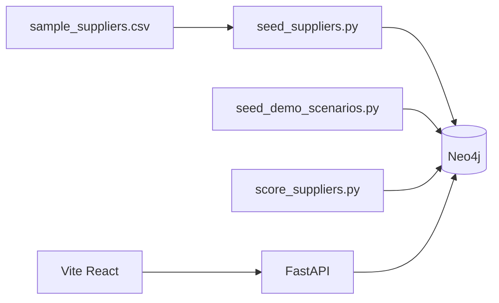

# Architecture — Portfolio Demo (Batch Mode)

Meridian's production architecture uses **Kafka** as the event bus ([ARCHITECTURE.md](../ARCHITECTURE.md)). For **portfolio demos and recruiter walkthroughs**, a simplified batch path avoids Kafka entirely.

## When to use batch mode

| Scenario | Mode | Command |
|----------|------|---------|
| Local 5-minute demo | **Batch** | `make seed-all` + `PIPELINE_MODE=batch python scripts/pipeline_batch.py` |
| Live signal refresh showcase | **Streaming** | `docker compose up -d kafka` + `make pipeline-refresh` |
| Production | **Streaming** | ECS + MSK per `DEPLOY.md` |

Set `PIPELINE_MODE=batch` to skip Kafka producers and run direct Neo4j refresh steps.

## Batch pipeline flow



No Kafka, Zookeeper, or consumer processes required.

## Commands

```bash
docker compose up -d neo4j
cp .env.example .env && set -a && source .env && set +a

make seed-all
PIPELINE_MODE=batch python scripts/pipeline_batch.py
python scripts/score_suppliers.py   # optional XGBoost rescore
```

## What batch mode skips

- GDELT / ACLED / AIS Kafka producers
- `GraphLoaderConsumer` polling
- Entity resolution consumer loop
- Real-time Slack alert emission from pipeline

Demo events come from `seed_demo_scenarios.py` and seeded `:Event` nodes instead.

## Honesty notes

Batch mode is **documented** in `docs/LIMITATIONS.md` — live ingestion layers are not exercised. UI banners (`ModelStatusBanner`, feature provenance) still apply.

See also: `docs/DEMO.md`, `docs/DEPLOY_QUICKSTART.md`.
