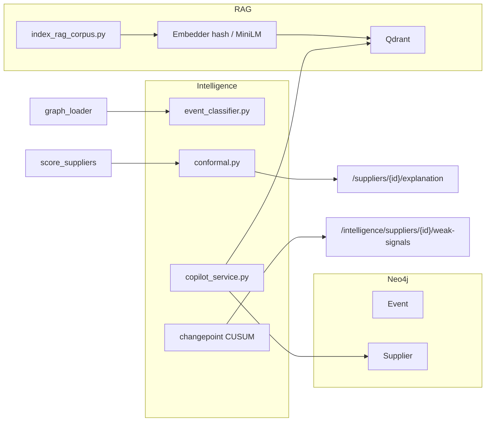

# Phase B — Intelligence Layer

Meridian Phase B adds Qdrant RAG grounding, structured event classification, conformal SCRI intervals, and lightweight changepoint weak-signal detection — all without requiring Qdrant or Ollama for the demo path.

**Prerequisite:** [Phase A — Real Data Foundation](REAL_DATA_PHASE_A.md) · **Next:** [Phase C — Predictive & Causal Research](REAL_DATA_PHASE_C.md)

## Architecture



**D-006 enforced:** LLM classifies events and composes grounded prose only — never outputs `risk_score` or SCRI percentages unless those values exist in Neo4j context.

## Environment variables

| Variable | Default | Description |
|----------|---------|-------------|
| `QDRANT_URL` | `http://localhost:6333` | Qdrant HTTP endpoint |
| `RAG_EMBED_MODE` | *(unset)* | Set to `hash` for deterministic test embeddings |
| `RAG_EMBED_MODEL` | `all-MiniLM-L6-v2` | sentence-transformers model when installed |
| `LLM_PROVIDER` | `stub` | `stub` \| `ollama` \| `openai` |
| `OLLAMA_BASE_URL` | `http://localhost:11434` | Local Ollama API |
| `OLLAMA_MODEL` | `gemma2:2b` | Ollama model name |
| `OPENAI_API_KEY` | *(unset)* | Required when `LLM_PROVIDER=openai` |
| `OPENAI_MODEL` | `gpt-4o-mini` | OpenAI chat model |
| `ENABLE_LLM_CLASSIFIER` | `false` | Hook classifier in GDELT graph_loader path |

Optional embeddings: `pip install -r requirements-dev.txt` (sentence-transformers).

## Make targets

```bash
make index-rag          # Neo4j events + suppliers + docs/METRICS.md → Qdrant
```

Graceful skip when Qdrant is down — logs `qdrant_index_skipped`, exit 0.

## Components

### Qdrant RAG (`src/rag/`)

| Module | Role |
|--------|------|
| `qdrant_client.py` | Connect + health probe |
| `embedder.py` | MiniLM or hash fallback (384-dim) |
| `collections.py` | Collections: `meridian_events`, `meridian_suppliers`, `meridian_methodology` |
| `copilot_service.py` | Retrieve top-k + Neo4j facts, compose answer |

### Event classifier (`src/intelligence/event_classifier.py`)

Rule-based default → `{event_type, severity_proxy, locations[], entities[]}`. Optional LLM when `ENABLE_LLM_CLASSIFIER=true`.

### Conformal SCRI (`src/intelligence/conformal.py`)

Split conformal on `data/disruption_labels.csv` holdout → `score_interval: {lower, upper, coverage, method}` on supplier explanation API.

### Changepoint weak signals (`src/intelligence/changepoint.py`)

CUSUM on daily event rate per supplier. Exposed at `GET /intelligence/suppliers/{id}/weak-signals`.

## API changes

| Endpoint | Change |
|----------|--------|
| `POST /intelligence/copilot` | + `citations[]`, RAG retrieval, LLM provider switch |
| `GET /suppliers/{id}/explanation` | + `score_interval` when calibration data exists |
| `GET /intelligence/suppliers/{id}/weak-signals` | **New** — CUSUM + weak-signal detector |

## Local verification

```bash
make up                  # includes Qdrant on :6333
make index-rag           # optional — graceful skip if Qdrant down
RAG_EMBED_MODE=hash python3 -m pytest tests/unit/test_phase_b.py -v
python3 -m pytest tests/unit/ -q
```

## Phase C pointer

Phase C (planned): Kafka rescore consumer, risk timeline API from TimescaleDB, expanded label corpus (500 rows), and production LLM batch classification pipeline.

See `DECISIONS.md` D-006 and `SESSIONS.md` Session 13.
