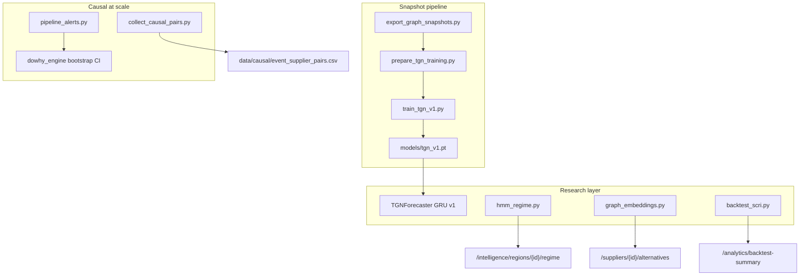

# Phase C — Predictive & Causal Research Layer

Meridian Phase C adds the research-track forecasting stack (TGN v1 GRU), regional HMM regime detection, DoWhy bootstrap confidence intervals, Node2Vec-style alternative suppliers, and SCRI backtest replay — all with graceful degradation when Neo4j, MLflow, or trained checkpoints are unavailable.

**Prerequisite:** [Phase B — Intelligence Layer](REAL_DATA_PHASE_B.md)

## Architecture



## Environment variables

| Variable | Default | Description |
|----------|---------|-------------|
| `SNAPSHOT_DIR` | `data/snapshots` | Daily supplier snapshot CSV directory |
| `TGN_MODEL_PATH` | `models/tgn_v1.pt` | GRU v1 checkpoint for `TGNForecaster` |
| `MLFLOW_TRACKING_URI` | `file:./mlruns` | MLflow run logging for TGN training |
| `CAUSAL_PAIR_LIMIT` | `100` | Max Event→Supplier pairs for causal export |
| `CAUSAL_PAIRS_CSV` | `data/causal/event_supplier_pairs.csv` | Offline causal pairs output |
| `DISRUPTION_LABELS_CSV` | `data/disruption_labels.csv` | Backtest ground-truth labels |
| `BACKTEST_OUTPUT` | `data/backtest/latest.json` | Backtest metrics JSON |
| `BACKTEST_RISK_THRESHOLD` | `0.55` | SCRI threshold for positive prediction |
| `BACKTEST_TOP_K` | `10` | K for precision@K metric |

## Stub vs production

| Component | MVP / stub | Production path |
|-----------|------------|-----------------|
| TGN forecast | GRU v1 on snapshot sequences; LSTM fallback | Full PyG Temporal TGN + graph attention |
| HMM regime | `hmmlearn` 3-state or threshold fallback | Calibrated on ACLED/GDELT regional rates |
| Alternatives | Hash random-walk embedding stub | Node2Vec / PyG on Neo4j subgraph |
| Causal pairs | Bootstrap CI when n&lt;30; DoWhy when n≥30 | Scheduled export + offline refutation |
| Backtest | Snapshot replay vs `disruption_labels.csv` | TimescaleDB timeline + live SCRI |

## Quick commands

```bash
# TGN v1 training pipeline
make export-snapshots    # daily — requires Neo4j
make prepare-tgn         # writes data/snapshots/tgn_manifest.json
make train-tgn           # needs ≥7 snapshot CSVs

# Causal & backtest
make collect-causal-pairs
make backtest-scri

# API smoke (no services)
uvicorn src.api.main:app --port 8002
curl localhost:8002/analytics/regime-summary
curl localhost:8002/suppliers/{id}/alternatives
curl localhost:8002/analytics/backtest-summary
```

## API endpoints (Phase C)

| Endpoint | Purpose |
|----------|---------|
| `GET /intelligence/regions/{region_id}/regime` | HMM regime for conflict zone id |
| `GET /analytics/regime-summary` | All reference zones + summary counts |
| `GET /suppliers/{id}/alternatives?limit=5` | Embedding-ranked lower-risk alternatives |
| `GET /analytics/backtest-summary` | Latest `data/backtest/latest.json` metrics |

Alert payloads may include `causal_correlation_ci_lower` / `causal_correlation_ci_upper` when sample count &lt; 30.

## Related docs

- [TGN_RESEARCH.md](TGN_RESEARCH.md) — v1 GRU training steps
- [CAUSAL_SCOPE.md](CAUSAL_SCOPE.md) — bootstrap CI method (D-005)
- [METRICS.md](METRICS.md) — SCRI vs research-track metrics

## Success criteria

- [x] `prepare_tgn_training.py` emits manifest with graph edge counts
- [x] `train_tgn_v1.py` trains GRU or logs `research_stub` to MLflow
- [x] `TGNForecaster` loads `models/tgn_v1.pt` when present
- [x] HMM regime API + map badge
- [x] Bootstrap correlation CI on small samples
- [x] Alternative suppliers API + EntityDrawer section
- [x] Backtest script + Graph Health KPI card
- [x] Unit tests pass without Neo4j/GPU
